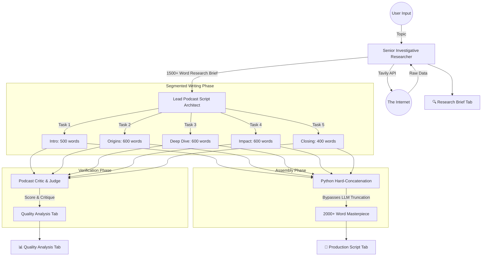

# System Architecture | AI Podcast Script Writer

## High-Level Flow
The system uses a **Segmented Multi-Agent Architecture** to bypass LLM output limits and ensure high-quality, long-form content (2000+ words).

## Key Components
1. **Engine Layer:** Dual-engine support with Grok xAI (Primary) and local Ollama llama3.2 (Hot Fallback).
2. **Research Layer:** Integration with Tavily API for AI-ready search results.
3. **Writing Layer:** Recursive context passing ensures every segment is factually grounded.
4. **UI Layer:** Streamlit-based "Producer's Desk" with typewriter-styled script preview.
