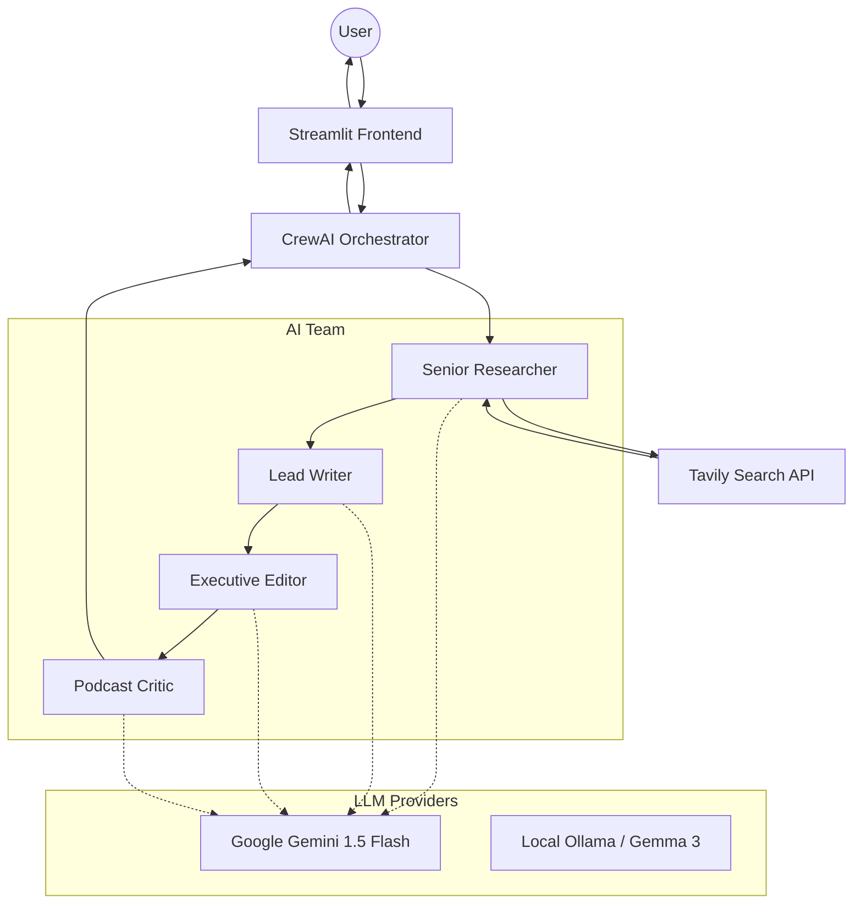

# System Architecture: Multi-Agent Podcast Script Writer

## High-Level Architecture
The application follows a modular, agent-based architecture coordinated by the CrewAI framework.

## Component Breakdown

### 1. Frontend (Streamlit)
*   Handles user input (Topic, API Keys).
*   Displays real-time status updates and final outputs.
*   Provides download links for the generated script.

### 2. Orchestration (CrewAI)
*   Manages the state and memory between agents.
*   Executes tasks in a sequential process (Process.sequential).
*   Handles LLM interactions via the `LLM` class.

### 3. Agents & Tools
*   **Researcher:** Equipped with the `Tavily Search` tool for deep web searching.
*   **Writer:** Context-aware agent that consumes research data.
*   **Editor:** Quality control agent focused on tone and formatting.
*   **Judge:** Implementation of the **LLM-as-Judge** pattern to provide an objective score.

### 4. External Integrations
*   **Tavily API:** Used for high-quality, AI-optimized search results.
*   **Gemini API:** Primary cloud LLM for deployment.
*   **Ollama (Fallback):** Supports local development and privacy-focused execution.
